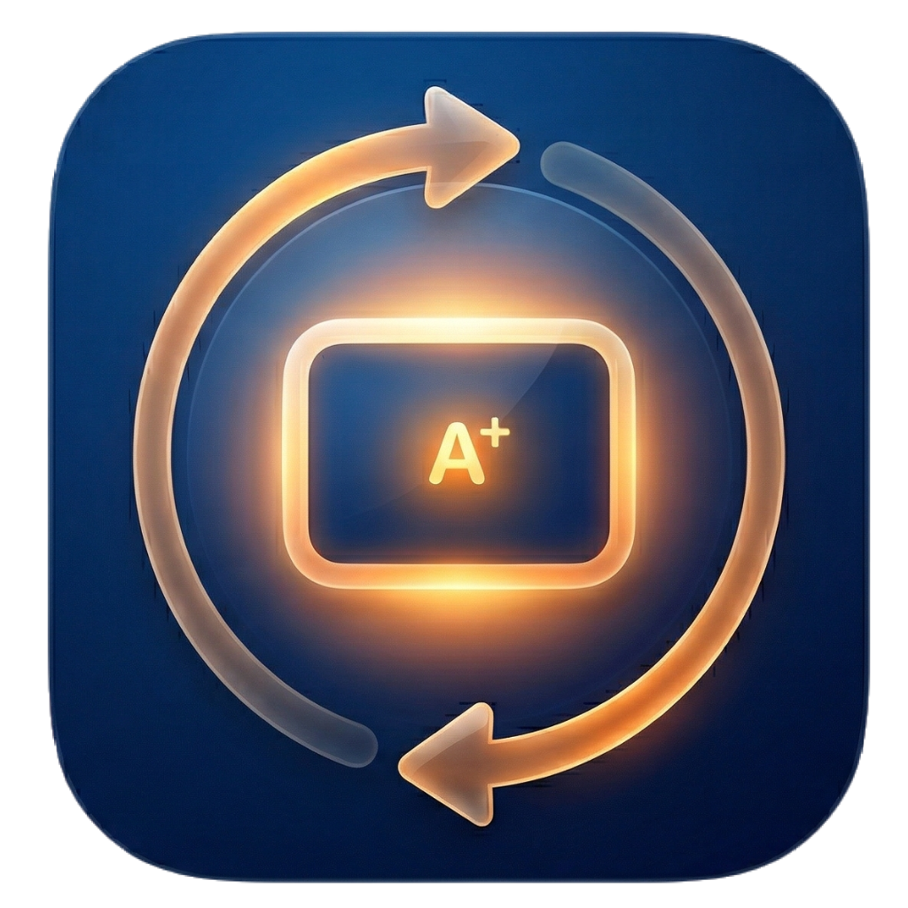

# LumeSync / 萤火互动课堂

<div align="center">

**基于 React + Electron 的低延迟局域网互动教学系统**

[](LICENSE)
[](https://nodejs.org/)
[](https://electronjs.org/)

[功能特性](#-功能特性) •
[快速开始](#-快速开始) •
[课件开发](#-课件开发) •
[文档](#-文档) •
[技术栈](#-技术栈)

</div>

---

## 📸 界面预览
<div align="center">
  
</div>

| 教师端 (LumeSync Teacher) | 学生端 (LumeSync Student) |
|---|---|
| 支持局域网课程同步、交互控制、多班级管理 | 支持实时接收课程内容、自动连接、提交作业 |

## ✨ 功能特性

### 核心功能
- 🔄 **课堂同步**：基于 Socket.io 的局域网实时同步（翻页、课程切换、学生状态等）
- 🖱️ **教师交互同步**：教师可开启同步，将操作实时同步到所有学生端（点击、拖拽、面板切换等）
- 📄 **课件热加载**：课件为纯文本脚本，运行时由 Babel 编译执行，无需构建工具
- 💻 **跨端桌面应用**：教师端 / 学生端均提供独立安装包
- 📦 **离线资源缓存**：课件依赖的 CDN 资源会自动下载并缓存到本地

### 编辑器与工具
- 🛠️ **VSCode 插件编辑器**：提供 VSCode 插件形式的课件编辑器，支持实时预览和 AI 辅助
- 🔍 **RAG 知识库**：内置教学知识库，支持按分类管理（系统API、互动组件、教学策略、动画效果等）
- 📁 **文件导入**：支持导入 TXT、Markdown、JSON 文件，自动切分为知识块
- 🗑️ **批量管理**：支持批量选择和删除自定义知识

### 课堂管理
- 🔧 **内容缩放**：教师端"课堂设置"可调课件内容缩放（60%～120%），降低溢出风险
- 👥 **多班级管理**：机房视图支持创建和管理多个班级的座位表，适用于一个机房服务于多个班级的场景
- 📊 **提交管理**：自动收集学生提交的内容，按班级和日期组织存储

## 🚀 快速开始

### 环境要求

- Node.js 18+
- Python 3.x（仅在打包/生成图标时需要）

### 安装依赖

```bash
npm install
```

### 启动服务端（Web 版本）

```bash
node server.js
```

访问：
- 教师端（Host）：http://localhost:3000
- 学生端（Viewer）：http://<局域网IP>:3000

### 启动桌面端（Electron）

```bash
# 教师端
npm run start:teacher

# 学生端
npm run start:student
```

### 打包应用

```bash
# 一键打包（生成教师端 + 学生端安装包）
build\build.bat

# 或分步执行
python build/convert-icons.py
npm run build:verify
npm run build:teacher
npm run build:student
```

更多细节见 [build/BUILD-README.md](build/BUILD-README.md)

## 📚 课件开发

### 课件文件格式

项目使用自有课件后缀 `.lume`（内容仍是可执行的 TSX/JSX/TS/JS 脚本文本）。

- 教师端导入/导出、VSCode 插件打开/保存统一使用 `.lume`
- 服务端扫描 `public/courses/` 时支持 `.lume`，并兼容旧格式（`.tsx/.ts/.jsx/.js`）
- 教师/学生端渲染使用固定 1280×720 画布并按窗口缩放显示，尽量保证显示一致性

### 基本示例

```tsx
function Slide1() {
  return (
    <div className="flex flex-col items-center justify-center min-h-full p-8">
      <h1 className="text-4xl font-bold">课程标题</h1>
    </div>
  );
}

window.CourseData = {
  title: "课程标题",
  icon: "📚",
  desc: "简短描述",
  color: "from-blue-500 to-indigo-600",
  dependencies: [
    // 外部依赖（服务器自动缓存，支持离线）
    // { localSrc: "/lib/chart.umd.min.js", publicSrc: "https://fastly.jsdelivr.net/npm/chart.js@4.4.1/dist/chart.umd.min.js" }
  ],
  slides: [{ id: "s1", component: <Slide1 /> }],
};
```

### 内置组件库

引擎提供以下可复用组件：

| 组件 | 说明 | 文档 |
|---|---|---|
| **`SurveySlide`** | 问卷通用组件（支持单选、多选、简答、评分、排序五种题型，自动提交和 CSV 导出） | [文档](docs/survey-component-guide.md) |
| **`WebPageSlide`** | 网页嵌入组件 | [文档](docs/API.md) |

详细使用方法：
- 问卷组件：[docs/survey-component-guide.md](docs/survey-component-guide.md)
- API 文档：[docs/API.md](docs/API.md)
- 机房视图：[docs/classroom-view-guide.md](docs/classroom-view-guide.md)

## 📖 文档

### 用户文档
- [用户说明-教师端](docs/用户说明-教师端.md)
- [用户说明-学生端](docs/用户说明-学生端.md)
- [VSCode 插件编辑器使用说明](apps/editor-plugin/README.md)

### 开发者文档
- [课件 API 完整文档](docs/API.md)
- [交互同步系统](docs/interaction-sync-guide.md)
- [知识库系统](docs/knowledge-base-guide.md)
- [知识库更新指南](docs/knowledge-update-guide.md)
- [知识库管理说明](public/knowledge/categories/README.md)

### 模板与示例
- [课件开发模板](docs/course-template.md)
- [KNN 课程示例](shared/public/courses/Knn.lume)
- [问卷组件示例](shared/public/courses/survey-demo.lume)

## 🏗️ 项目结构

```
SyncClassroom/
├── server.js                          # 主入口文件（仅 ~150 行）
├── server/                            # 后端服务模块
│   ├── config.js                      # 配置管理（环境变量、路径等）
│   ├── courses.js                     # 课程扫描和管理
│   ├── data.js                        # 文件夹数据管理（CRUD）
│   ├── proxy.js                       # CDN 代理和缓存
│   ├── routes.js                      # API 路由定义
│   ├── socket.js                      # Socket.io 实时通信
│   ├── submissions.js                 # 学生提交和座位表管理
│   ├── utils.js                       # 工具函数
│   └── README.md                      # 架构详细说明
├── public/
│   ├── index.html                     # Web 入口页面
│   ├── engine/                        # 前端引擎模块
│   ├── courses/                       # 课件目录（.lume 为主，兼容 .tsx/.js 等）
│   ├── lib/                           # 第三方库缓存目录
│   ├── weights/                       # AI 模型权重缓存目录
│   └── knowledge/                     # RAG 知识库
│       ├── index.js                   # 知识库主索引
│       ├── processor.js               # 知识处理器（文件导入）
│       └── categories/                # 知识分类目录
│           ├── system-api.js         # 系统API
│           ├── interactive-components.js  # 互动组件
│           ├── teaching-strategies.js     # 教学策略
│           ├── animations.js         # 动画效果
│           ├── styling.js            # 样式系统
│           ├── state-management.js   # 状态管理
│           ├── multimedia.js         # 多媒体
│           └── best-practices.js     # 最佳实践
├── apps/
│   ├── teacher/                       # 教师端 Electron 应用
│   ├── student/                       # 学生端 Electron 应用
│   └── editor-plugin/                # VSCode 插件编辑器
├── build/                             # 打包相关脚本与资源
└── .github/workflows/release.yml      # 打 tag 自动发布 Release
```

**详细架构文档：** [server/README.md](server/README.md)

## 🛠️ 技术栈

### 后端
- **框架**: Express.js
- **实时通信**: Socket.io
- **模块化架构**: 按功能拆分为 8 个独立模块
- **代理服务**: CDN 资源自动下载和缓存

### 前端
- **框架**: React 18
- **编译**: Babel Standalone（课件热加载）
- **UI 框架**: Tailwind CSS
- **图标**: FontAwesome 6

### 桌面端
- **框架**: Electron
- **打包**: electron-builder
- **多架构**: 教师端 / 学生端

## 📝 RAG 知识库系统

VSCode 插件内置智能知识库，支持以下功能：

- **分类管理**：知识按分类存储（系统API、互动组件、教学策略、动画效果、样式系统、状态管理、多媒体、最佳实践）
- **智能检索**：基于关键词匹配和相似度计算，自动检索相关知识
- **文件导入**：支持导入 TXT、Markdown、JSON 文件，自动切分为知识块
- **批量操作**：支持批量选择和删除自定义知识
- **内置知识**：预置 21 条内置知识，涵盖 API 使用、教学策略、最佳实践等

知识库位置：`public/knowledge/categories/`，按分类文件管理，方便扩展和更新。

## 🤝 贡献

欢迎提交 Issue 和 Pull Request！

## 📄 许可证

本项目采用 [MIT](LICENSE) 许可证。

---

<div align="center">

**Made with ❤️ by SyncClassroom Team**

[⬆ 回到顶部](#syncclassroom--萤火互动课堂)

</div>
