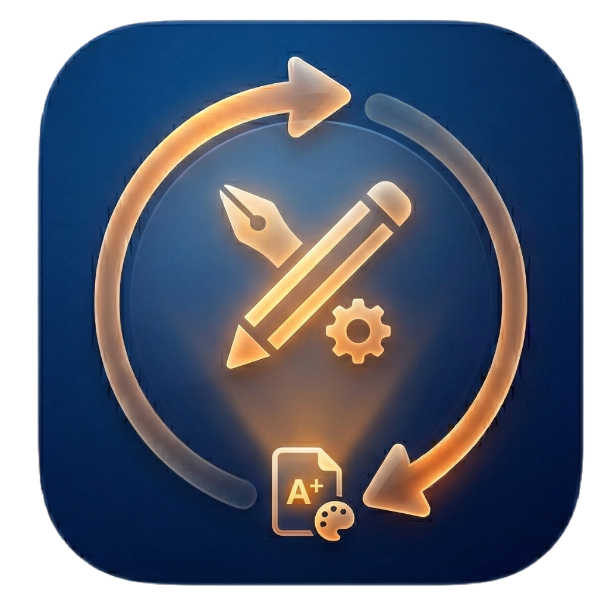

# 萤火互动课堂（SyncClassroom / LumeSync）

基于 React + Electron 的低延迟局域网互动教学系统，包含教师端、学生端，以及 AI 课件编辑器（LumeSync Editor）。

| 教师端 / 学生端 | AI 课件编辑器 |
|---|---|
|  |  |

## 功能概览

- 课堂同步：基于 Socket.io 的局域网实时同步（翻页、课程切换、学生状态等）
- 课件热加载：课件为纯文本脚本，运行时由 Babel 编译执行，无需构建工具
- AI 课件编辑器：对话式生成互动课件，实时预览 + 源码编辑（16:9 预览比例）
- 跨端桌面应用：教师端 / 学生端 / 编辑器均提供独立安装包
- 离线资源缓存：课件依赖的 CDN 资源会自动下载并缓存到本地
- 内容缩放：教师端“课堂设置”可调课件内容缩放（60%～120%），降低溢出风险

## 课件文件格式（.lume）

项目使用自有课件后缀 `.lume`（内容仍是可执行的 TSX/JSX/TS/JS 脚本文本）。

- 教师端导入/导出、编辑器打开/保存统一使用 `.lume`
- 服务端扫描 `public/courses/` 时支持 `.lume`，并兼容旧格式（`.tsx/.ts/.jsx/.js`）
- 教师/学生端渲染使用固定 1280×720 画布并按窗口缩放显示，尽量保证显示一致性

## AI 课件编辑器（LumeSync Editor）

- 自然语言创作：通过对话描述需求，AI 生成完整课件脚本
- 流式实时预览：生成过程中预览区同步更新，固定 16:9 比例
- 源码编辑体验：行号显示、滚动同步，便于精细化调整
- 一键修复：课件编译错误可一键将错误信息回传给 AI 自动修复

## 快速开始（开发模式）

### 环境要求

- Node.js 18+
- Python 3.x（仅在打包/生成图标时需要）

### 启动服务端（Web 版本）

```bash
npm install
node server.js
```

访问：
- 教师端（Host）：http://localhost:3000
- 学生端（Viewer）：http://<局域网IP>:3000

### 启动桌面端（Electron）

```bash
npm install
npm run start:teacher
npm run start:student
npm run start:editor
```

## 打包

```bash
# 一键打包（生成教师端 + 学生端 + 编辑器安装包）
build\\build.bat

# 或分步执行
python build/convert-icons.py
npm run build:verify
npm run build:teacher
npm run build:student
npm run build:editor
```

更多细节见 [build/BUILD-README.md](build/BUILD-README.md)。

## 学生端说明

- 安装需要管理员权限
- 自动注册为 Windows 服务（`LumeSyncStudent`），开机自启
- 普通用户无法关闭服务
- 卸载时需要管理员密码（默认 `admin123`）
- 管理员密码可在教师端“课堂设置”中修改并推送到在线学生端

## 课件开发

课件文件放入 `public/courses/`，刷新教师端即可识别。

### 基本示例

```tsx
function Slide1() {
  return (
    <div className="flex flex-col items-center justify-center min-h-full p-8">
      <h1 className="text-4xl font-bold">课程标题</h1>
    </div>
  );
}

window.CourseData = {
  title: "课程标题",
  icon: "📚",
  desc: "简短描述",
  color: "from-blue-500 to-indigo-600",
  dependencies: [
    // 外部依赖（服务器自动缓存，支持离线）
    // { localSrc: "/lib/chart.umd.min.js", publicSrc: "https://fastly.jsdelivr.net/npm/chart.js@4.4.1/dist/chart.umd.min.js" }
  ],
  slides: [{ id: "s1", component: <Slide1 /> }],
};
```

更多参考：
- [docs/course-template.md](./docs/course-template.md)（课件开发模板）
- [docs/API.md](./docs/API.md)（课件 API 文档）

## 用户使用说明（零基础）

- [docs/用户说明-教师端.md](./docs/用户说明-教师端.md)
- [docs/用户说明-学生端.md](./docs/用户说明-学生端.md)
- [docs/用户说明-AI课件编辑器.md](./docs/用户说明-AI课件编辑器.md)

## 项目结构

```
SyncClassroom/
├── server.js                          # 后端服务（Express + Socket.io + CDN 代理）
├── public/
│   ├── index.html                     # Web 入口页面
│   ├── editor.html                    # 编辑器入口页面
│   ├── engine/                        # 前端引擎模块
│   ├── editor/                        # 编辑器前端代码
│   ├── courses/                       # 课件目录（.lume 为主，兼容 .tsx/.js 等）
│   ├── lib/                           # 第三方库缓存目录
│   └── weights/                       # AI 模型权重缓存目录
├── electron/
│   ├── main-teacher.js                # 教师端主进程
│   ├── main-student.js                # 学生端主进程
│   ├── main-editor.js                 # 编辑器端主进程
│   ├── preload.js                     # IPC 桥接
│   └── logger.js                      # 日志系统
├── build/                             # 打包相关脚本与资源
└── .github/workflows/release.yml      # 打 tag 自动发布 Release
```

## 技术栈

- 后端：Express + Socket.io
- 前端：React 18 + Babel Standalone
- UI：Tailwind CSS + FontAwesome
- 桌面端：Electron + electron-builder

## 许可证

[MIT](https://opensource.org/licenses/MIT)
